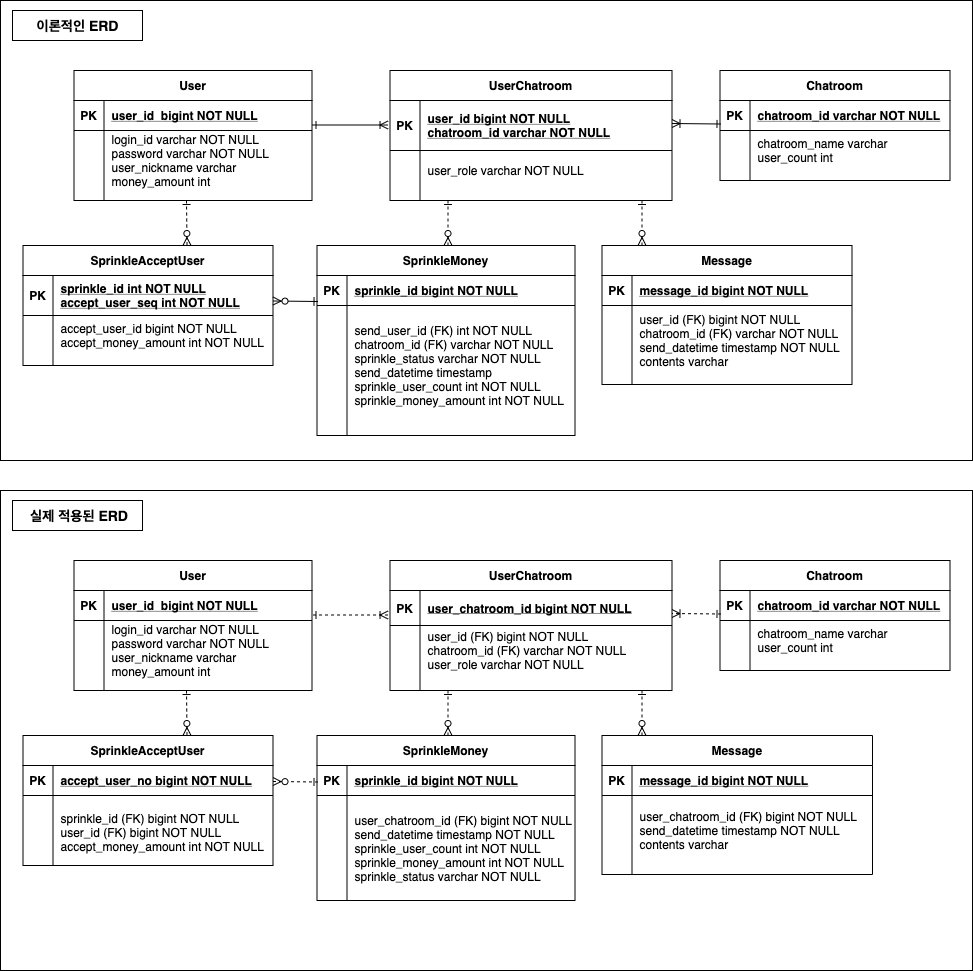

# 카카오페이 사전과제 - 카카오페이 뿌리기 기능 API 개발
## 목차
- [1. 개발 환경](#1.-개발-환경)
- [2. 빌드 및 실행하기](#2.-빌드-및-실행하기)
- [3. 기능 요구사항](#3.-기능-요구사항)
- [4. 핵심 문제 해결 전략](#4.-핵심-문제-해결-전략)
- [5. User story & Product backlog](#5.-user-story-&-product-backlog)

---

## 1. 개발 환경
- 기본 환경
    - IDE: IntelliJ IDEA
    - OS: Mac OS X
    - GIT
- Server
    - Java11
    - Spring Boot 2.4.0
    - JPA
    - H2
    - lombok
    - Gradle
    - Junit4


## 2. 빌드 및 실행하기
### 터미널 환경
- Java/Git 은 사전에 설치되어 있는 것을 가정한다. (미설치시 별도 설치 필요)

```
$ git clone https://github.com/incheol77/kakaopay-sprinklingmoney.git
$ cd kakaopay-task3 
$ ./gradlew clean build
$ java -jar build/libs/sprinklingmoney-0.0.1-SNAPSHOT.jar
```

- 접속 Base URI: `http://localhost:8080`


## 3. 기능 요구사항
### Introduction  
카카오페이에는 머니 뿌리기 기능이 있습니다.
- 사용자는 다수의 친구들이 있는 대화방에서 뿌릴 금액과 받아갈 대상의 숫자를
입력하여 뿌리기 요청을 보낼 수 있습니다.
- 요청 시 자신의 잔액이 감소되고 대화방에는 뿌리기 메세지가 발송됩니다.
- 대화방에 있는 다른 사용자들은 위에 발송된 메세지를 클릭하여 금액을 무작위로
받아가게 됩니다.

이번 과제에서는 UI 및 메세지 영역은 제외한 간소화된 REST API를 구현하는 것이
목표입니다.


### 요구사항 (개요)
- 뿌리기, 받기, 조회 기능을 수행하는 REST API 를 구현합니다.
    - 요청한 사용자의 식별값은 숫자 형태이며 "X-USER-ID" 라는 HTTP Header로
전달됩니다.
    - 요청한 사용자가 속한 대화방의 식별값은 문자 형태이며 "X-ROOM-ID" 라는
HTTP Header로 전달됩니다.
    - 모든 사용자는 뿌리기에 충분한 잔액을 보유하고 있다고 가정하여 별도로
잔액에 관련된 체크는 하지 않습니다.
- 작성하신 어플리케이션이 다수의 서버에 다수의 인스턴스로 동작하더라도 기능에
문제가 없도록 설계되어야 합니다.
- 각 기능 및 제약사항에 대한 단위테스트를 반드시 작성합니다.

### 상세 구현 요건 및 제약 사항
#### 1. 뿌리기 API
- 뿌릴 금액, 뿌릴 인원을 요청값으로 받습니다.
- 뿌리기 요청건에 대한 고유 token을 발급하고 응답값으로 내려줍니다.
- 뿌릴 금액을 인원수에 맞게 분배하여 저장합니다. (분배 로직은 자유롭게 구현해 주세요.)
- token은 3자리 문자열로 구성되며 예측이 불가능해야 합니다.

#### 2. 받기 API
- 뿌리기 시 발급된 token을 요청값으로 받습니다.
- token에 해당하는 뿌리기 건 중 아직 누구에게도 할당되지 않은 분배건 하나를
API를 호출한 사용자에게 할당하고, 그 금액을 응답값으로 내려줍니다.
- 뿌리기 당한 사용자는 한번만 받을 수 있습니다.
- 자신이 뿌리기한 건은 자신이 받을 수 없습니다.
- 뿌린기가 호출된 대화방과 동일한 대화방에 속한 사용자만이 받을 수
있습니다.
- 뿌린 건은 10분간만 유효합니다. 뿌린지 10분이 지난 요청에 대해서는 받기
실패 응답이 내려가야 합니다.

#### 3. 조회 API
- 뿌리기 시 발급된 token을 요청값으로 받습니다.
- token에 해당하는 뿌리기 건의 현재 상태를 응답값으로 내려줍니다. 현재
상태는 다음의 정보를 포함합니다.
- 뿌린시각, 뿌린금액, 받기완료된금액, 받기완료된정보([받은금액,받은
사용자 아이디] 리스트)
- 뿌린 사람 자신만 조회를 할 수 있습니다. 다른사람의 뿌리기건이나 유효하지
않은 token에 대해서는 조회 실패 응답이 내려가야 합니다.
- 뿌린 건에 대한 조회는 7일 동안 할 수 있습니다.


## 4. 핵심 문제 해결 전략
### Design & Develop Notes
- 핵심 Data Model/Biz Logic 구조 : '사용자-대화방-대화'의 기본적인 채팅 Data Model 구조 + 복수의 계좌이체와 유사한 Biz Logic 구조
    - '뿌리기'의 대상인 '머니'를, 현금 증감 등의 필요하지 않은 일반적인 '메시지'로 생각할 경우 사용자-대화방-대화(메시지) 의 Data Model과 유사하다.
    - '대화방' 이라는 상황과 '뿌리기' 라는 행위로 인해 분석 초반에는 본 업무 요건의 본질을 '메시지 전달'만으로 한정지어 생각하였으나, 
    A라는 '사용자'가 B,C,D 라는 '대화방' 내의 '사용자'들에게 현금('머니')을 전달한다는 행위의 본질은 A라는 은행 계좌에서 B,C,D 라는 계좌로 
    복수의 계좌 이체건을 하나의 트랜잭션내에서 처리하는 것과 동일한 것으로 볼 수 있다. 
    - 따라서, 기본적인 Data 구조는 사용자-대화방-대화 의 구조를 사용하되, Biz Logic 은 '복수건의 계좌이체' 의 
     '사용자 A의 잔액 감소분 = 사용자 B의 잔액 증가분' 과 유사하게 구성하기로 하였다
    - 이를 대화방 내의 복수의 사용자로 확대하여 '사용자 A의 뿌리기 금액 = 대화방 사용자별 잔액 증가분의 합계'
    로 적용할 것이며, 이때 '머니'가 전달되는 대상 사용자의 목록으로서 '대화방' 을 사용하기로 한다.
    
### Domain 설계 (Entity, Repository)
- 주요 포인트  
    - '사용자' 가 복수의 '대화방'에 등록 가능 & '대화방' 에는 복수의 '사용자' 가 등록 가능  
        - 따라서 '사용자':'대화방' = M : N 관계 (다대다 관계)를 해소하기 위해서 '참여대화방'이라는 관계 엔터티(테이블)을 사용한다. 
    - '참여대화방' 내에서 발생할 수 있는 복수의 '뿌리기'는 일반적인 '대화방-메시지'의 관계와 동일하게 1:M 관계로 구성한다.
    - 대화방(chatroom)의 식별자가 문자 형태로 주어졌으나 대화방 식별자와 대화방 이름을 분리한 이유
        - 대화방의 식별자는 문자타입으로 요건이 주어졌으나 '대화방명'을 식별자로 사용할 경우 
        한번 설정한 '대화방 제목'을 변경하기 어려우므로 (식별자 변경...거대한 고통의 시작...ㅠㅠ) 
        별도의 '대화방명(chatroomName)' 을 두어 자유롭게 대화방명을 변경할 수 있게 한다. 
        (본 과제의 요건에 포함되어 있지는 않으나 매우 일반적인 대화방의 기능이므로 추가함)
    - '뿌리기받은사용자(SprinkleAcceptUsers)' 를 별도의 엔티티로 분리한 이유 :
        - 본 과제에서 사용한 database 인 h2 에는 Array 데이터 타입이 존재하므로
        뿌리기를 받은 사용자 정보를 '뿌리기(SprinkleMoney)' 엔티티의 속성(Array타입)'으로 
        관리하는 것도 가능하나, 만일 Array 타입을 지원하지 않는 다른 DB (e.g : Mysql)를 사용하는 것으로
        결정이 되는 상황을 고려한다면 데이터 구조의 변경이 필요하다. 
        (json 형태로 저장한 후 parsing하여 사용하는 방법 또는 별도 엔티티를 분리하는 방법 등)
        - 따라서 향후 확장성과 변경에 대한 유연성을 확보하기 위해서 '뿌리기받은사용자' 를 별도의 엔티티로 관리하기로 결정하였다.
        
- entity
    - '사용자' (user) : '사용자' 의 일반 정보를 저장. ('머니잔액' 포함)
    - '대화방' (chatroom) : '대화방' 의 일반 정보를 저장. ('뿌리기' 등 메시지 관련 정보는 불포함)
    - '참여대화방' (user-chatroom) : '대화방'에 참여하고 있는 '사용자'의 관계 정보를 저장 
    - '뿌리기' (splinkemoney) : '머니뿌리기' 관련 정보를 저장
    - '메시지' (messages) : '대화 메시지' 관련 정보를 저장
    - '뿌리기받은사용자' (SprinkleAcceptUsers) : 뿌린 머니를 받은 사용자 정보를 저장

- Data Model (ERD)
    - 주의 사항 (ERD 를 두가지 버전으로 나누게 된 이유) : 
    - '참여대화방(UserChatroom)' 엔티티의 경우 '사용자(User)' 와 '대화방(Chatroom)' 의
    관계를 매핑 하기 위한 (M:N관계 해소) 관계 엔티티 이므로 각각의 식별자 (userId, chatroomId) 를
    직접 상속받는 '식별 관계 (상위 엔티티의 식별자를 자신의 식별자로 모두 사용 - 복합식별자)' 이어야 한다.
    만일 식별관계로 상속을 받지 않을 경우 하위의 '뿌리기(SprinkleMoney)', '메시지(Message)' 등의
    엔티티에서 userId, chatroomId 를 상속받을 수 없기 때문에 자신의 식별자를 상속시키기 위한 목적이 있을 경우에는
    반드시 '식별관계' 로 상속을 받아야 한다. (데이터 모델링 기본 이론 : 상속을 받는 엔티티는 부모 엔티티의 식별자만을 상속받을 수 있다.)
    - 그러나 JPA 에서는 엔티티 마다 단일 식별자를 필요로 하므로 이를 해결하기 위해 '참여대화방(UserChatroom)' 에
    단일식별자인 UserChatroomId 를 두었고 (결과적으로 '사용자', '대화방' 으로 부터 비식별관계로 상속받은 것과 유사한 모델이 됨)
    이론적으로는 '참여대화방(UserChatroom)' 으로부터 상속을 받은 '뿌리기(SprinkleMoney)' 와 '메시지(Message)' 는
    식별자를 상속받을 수 없으나 '참여대화방' 의 본질식별자 (userId+chatroomId)를 상속받은 것 처럼 설계를 하였다.
    - 따라서 '참여대화방(UserChatroom)' 의 식별자 (PK 이므로 unique key로 사용)는 인조식별자인 userChatroomId 이나
    실질적으로 데이터 1건을 발생시키는 본질 식별자는 userId+chatroomId 이므로 데이터 정합성을 보장하기 위해서
    반드시 PK 이외에 userId+chatroomID 로 unique key index 를 생성해야 한다.
    - '뿌리기받은사용자(SprinkleAcceptUsers)'의 경우에도 이와 유사한 내용이 적용되었다.
    
    - SprinklingMoney-ERD



## 5. User story & Product Backlog 
- 실제 업무를 진행하는 상황을 가정하여 Confluence 와 Jira 를 활용하여 개발을 진행하는 방안을 생각했었으나, 
다소 시간 제한의 압박이 있는 관계로 본 README.md 를 활용하기로 하였다. 
- 실제 스크럼 등을 통해 업무를 진행할 때에는 Kandan board 등을 활용하여 Backlog->Todo->Development->Test->Deployment->Done 
의 과정을 거치도록 단위 Task/Subtask 를 관리하겠지만 본 과제에서는 kanban board 없이 Backlog->Done 만을 관리


### Story & Task (Product Backlog)
#### Domain 구조
- SM-DMN-S003 : 사용자는 대화방내의 사용자들에게 '뿌리기' 서비스를 이용할 수 있으며, 뿌리기 요청 시 대화방에는 뿌리기 메세지가 발송된다.
    - SM-DMN-T004 : '뿌리기' 엔티티 구현 & unit test 
        - 속성 : userid, chatroomId, sendDatetime, sendAmount, 
                acceptTotalAmount, acceptUser[userId, acceptAmount]
    - SM-DMN-T005 : '메시지' 엔티티 구현 & unit test
        - 속성 : userid, chatroomId, sendDatetime, contents 


#### Service1 : 뿌리기
- SM-API1-S001 : 사용자는 자신이 참여하고 있는 대화방 내의 친구들에게 머니를 나눠주기 위해 머니 뿌리기 요청을 보낼 수 있다. 
    - SM-API1-T001 : 대상 대화방 내의 사용자들에게만 '뿌리기' 메시지를 전송하는 API 기본 구조 구현 및 unit test (POST)
        - 요청한 사용자의 식별값은 숫자 형태이며 "X-USER-ID" 라는 HTTP Header 로 전달
        - 요청한 사용자가 속한 대화방의 식별값은 문자 형태이며 "X-ROOM-ID" 라는 HTTP Header로 전달
        
- SM-API1-S002 : 사용자는 머니 뿌리기를 위해 뿌릴 금액과 뿌릴 인원을 입력할 수 있다.
    - SM-API1-T002 : '뿌리기 API'의 parameter (뿌릴금액, 뿌릴인원) 입력 부분 구현 및 unit test
    - SM-API1-T003 : 뿌릴금액을 뿌릴인원의 인원수에 맞추어 분배하여 spinkle 엔티티에 저장 (분배 로직은 균등분배로 정함)

- SM-API1-S003 : '뿌리기'를 요청한 사용자 자신의 잔액은 '뿌린금액' 만큼 감소되고 '참여대화방'에 뿌리기 메시지가 발송된다. 
    - SM-API1-T004 : 뿌리기 요청 사용자의 잔액 감소 기능 구현 및 unit test
    - SM-API1-T005 : 뿌리기가 요청된 참여 대화방에 뿌리기 내용 (뿌린 사용자, 뿌린 금액, 뿌릴 인원) 에 대한 메시지 저장 기능 구현 및 unit test 
        - 대화방에 메시지가 실제로 발송되는 기능은 본 과제 범위를 벗어나므로 구현하지 않음

- SM-API1-S004 : '뿌리기'를 요청한 사용자는 뿌리기 요청건에 대해 발급된 고유 token을 응답값으로 받는다. 
    - SM-API1-T006 : '뿌리기' 요청건의 결과 처리 구현 및 unit test 
        - 뿌리기 요청건에 대한 고유 token[3자리random문자열] 을 발급
        - token 을 response value 로 내려줌 


#### Service2 : 받기
- SM-API2-S001 : 뿌리기가 요청된 대화방 내의 사용자들은 사용자당 각 한번씩 뿌려진 머니를 받을 수 있다.
    - SM-API2-T001 : 뿌리기 요청의 상태가 OPEN 일 경우에만 받기가 가능하도록 체크하는 기능 구현 및 unit test (status : OPEN/COMPLETE/EXPIRED)
    - SM-API2-T002 : 뿌린 머니를 받은 사용자들의 잔액을 증가하는 기능 구현 및 unit test
    - SM-API2-T003 : 뿌린 머니를 한번 받은 사용자는 다시 받을 수 없도록 체크하는 기능 구현 및 unit test
    - SM-API2-T004 : 받기 요청이 처리될 때마다 뿌리기 처리 상태(뿌린시각, 뿌린금액, 받기완료금액, 받기완료정보[받은사용자id, 받은금액])를 갱신하는 기능 구현 및 unit test
    - SM-API2-T005 : 받기 완료된 사용자의 수가 '뿌리기' 요청의 뿌린인원 과 비교하여 같으면 뿌리기 요청의 상태를 COMPLETE 로 변경하는 기능 구현 및 unit test 
        - 사용자 수 비교 logic
        - 받기 완료된 뿌리기의 status 변경 logic (OPEN->COMPLETE)
        - 받기 완료시 해당 뿌리기가 완료되었다는 메시지 생성
    
- SM-API2-S002 : 사용자 자신이 뿌린 머니는 자신이 받을 수 없다. 
    - SM-API2-T006 : 뿌린 사용자와 받으려는 사용자가 동일id 를 사용할 경우 받을 수 없도록 체크하는 기능 구현 및 unit test
    
- SM-API2-S003 : 사용자가 뿌린 '뿌리기' 는 10분간만 유효하여 10분 경과후에는 받을 수 없다. 
    - SM-API2-T007 : '뿌리기' 요청이 최초 요청 후 10분 경과시 만료시키는 기능 구현 및 unit test (10분 경과시 status를 EXPIRED로 변경)
        - 경과 시간 비교 logic
        - 뿌리기 자신이 매초 간격으로 10분 경과 여부를 체크하여 10분 경과시 status 를 갱신하는 logic 
    - SM-API2-T008 : 기간이 만료된 뿌리기에 대한 받기 요청시, 기간만료 exception 메시지 출력 기능 구현 및 unit test 
        - 실제 서비스 구현시에는 기간이 만료된 뿌리기 메시지를 클릭/터치할 경우 '기간이 만료된 뿌리기입니다' 등의 별도 에러 메시지 화면으로 전환
    - SM-API2-T009 : 뿌리기를 받을 사용자 모두가 받음 요청을 완료하기 전에 기간이 만료될 경우 남은 잔액을 뿌리기 요청 사용자에게 반환하는 기능 구현 및 unit test
        - 뿌리기 요청 기간 만료시에 뿌린 금액과 받은 금액의 합을 비교하는 logic
        - 뿌린 금액 중 잔액이 있을 경우 뿌리기 요청 사용자의 잔액을 해당 금액만큼 증가시키는 logic 
        - 해당 금액만큼 반환되었다는 메시지를 생성하는 logic 


#### Service3 : 조회하기 
- SM-API3-S001 : '뿌리기'를 요청한 사용자는 뿌리기 처리 상태(뿌린시각, 뿌린금액, 받기완료금액, 받기완료정보[받은사용자id, 받은금액])를 조회할 수 있다. 
    - SM-API3-T001 : 뿌리기 조회 요청 (GET) 을 처리하기 위한 기능 구현 및 unit test
        - 유효한 사용자 여부 (뿌리기 생성 사용자id=조회 요청 사용자id)를 체크하는 logic
        - 뿌리기 처리 상태를 테이블에서 조회하여 반환해 주는 logic 구현
- SM-API3-S002 : '뿌리기'를 요청한 사용자는 뿌리기 요청 후 7일 간만 뿌리기 처리 상태를 조회할 수 있다.
    - SM-API3-T002 : 뿌리기 조회 요청에 대한 조회 가능 기간 만료 여부를 체크하기 위한 기능 구현 및 unit test 
        - 뿌리기 조회 요청시 조회 가능 기간 만료 여부 (조회 시점 <= 뿌리기 생성 시점 + 7일)를 확인하는 logic
        - 기간 만료시 ExpiredException (가칭) 처리 logic 


#### 가용성/확장성 
이 항목은 kubernetes 기반의 container 로 인스턴스가 구성되는 것을 전제로 한다.
- SM-ARCH-S001 : 뿌리기 서비스는 다수의 서버에 다수의 인스턴스로 동작하더라도 기능에 문제가 없이 정상 동작해야 한다.
    - SM-ARCH-T001 : 트래픽 급증가시 scale out 이 가능하도록 data 분산/복제 구현 및 unit test 
        - 데이터 분산/복제 기능 
        - scale out 시 뿌리기/받기/조회 기능 정상 동작 여부 검증

        
#### MSA 로의 전환
서비스의 규모가 증가할 경우 복잡도 감소, 유연한 배포, 확장성 증가, 개발 생산성 증가 등을 목적으로 MSA 로의 전환이 필요할 수 있으므로
이를 고려한 설계안을 작성한다. (본 과제 범위는 아닐 수 있으나 실제 서비스 개발/운영을 위해서는 고려해 둘 필요가 있음)


### Story & Task (Done)
#### Domain 구조
- SM-DMN-S001 : 카카오페이의 사용자는 대화방을 통해서 서비스를 이용할 수 있다.
    - SM-DMN-T001 : '사용자' 엔티티 구현 & unit test 
        - 식별자 : 숫자 (userId) -> 추후 "X-USER-ID" 라는 HTTP Header로 전달
        - 속성 : loginId, password, userNickname, moneyAmount
        - 하기 commit 에서 반영 
            - https://github.com/incheol77/kakaopay-sprinklingmoney/commit/712e9284f78b7338a8c76fa5b3e2aeb525a18602
            
    - SM-DMN-T002 : '대화방' 엔티티 구현 & unit test 
        - 식별자 : 문자 (chatroomId) -> 추후 "X-ROOM-ID" 라는 HTTP Header로 전달
        - 속성 : chatroomName, userCount
        - 하기 commit 에서 반영 
            - https://github.com/incheol77/kakaopay-sprinklingmoney/commit/9e597a80d384d925092a3c840d552770d19107dc
            
- SM-DMN-S002 : 카카오페이 사용자는 복수의 대화방에 참여할 수 있고, 하나의 대화방에는 복수의 대화방에 참여할 수 있다.
    - SM-DMN-T003 : '사용자':'대화방' 의 M:N 관계를 해소하기 위해 관계 엔티티인 '사용자참여대화방' 엔티티 구현 & unit test 
        - 식별자 : 숫자 (userChatroomId)
        - 속성 : userId, chatroomId, userRole
        - 하기 commit 에서 반영 
            - https://github.com/incheol77/kakaopay-sprinklingmoney/commit/bd233b5d8dc32f818da5695782b24b1b18e62e35
            

#### Service1 : 뿌리기

#### Service2 : 받기

#### Service3 : 조회하기 

#### 가용성/확장성

